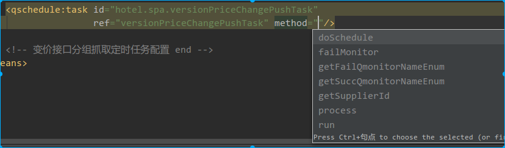
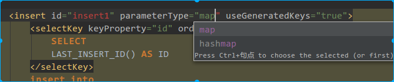
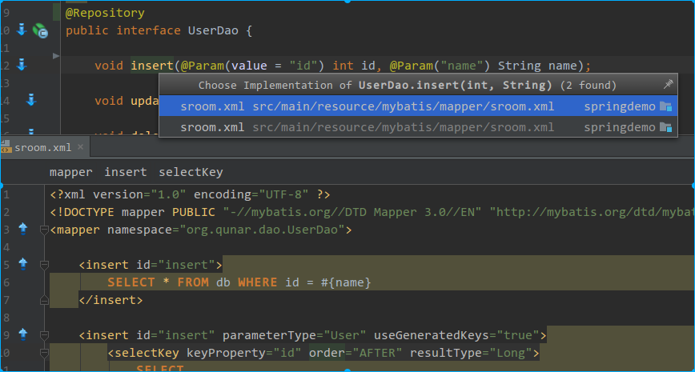
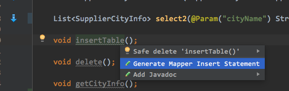
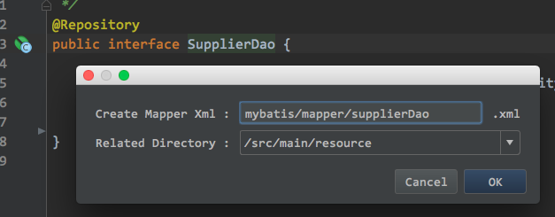

{toc}

# [提供打包插件jar](.idea/mybatis-plugin.jar)

## Mybatis Plugin For IDEA

### 提供的功能
1. mybatis接口和xml跳转、<include><sql>等内部节点的关联跳转
2. mybatis的configuration、mapper文件校验，解析typeAliases等
3. 解析spring mybatis集成配置
3. mybatis自动代码提示，如：id、resultMap、${}、#{}等
4. mapper方法xml跳转、#{}${}参数跳转
5. and more...

### 2016.12.05 v1.4.2更新
1. \#{} \${}参数跳转支持原始类型
2. 修复isMybatis方法可能死循环的问题
3. 解析module配置，获取resource路径（之前通过名称判断）

### 2016.12.03 v1.4.0更新
1. 增加interface创建xml文件intention, 及ui dialog
2. 增加interface方法创建xml statement intention
3. 增加xml文件中#{} ${}参数的关联跳转
4. 修复spring bean name重复问题

### 插件截图

